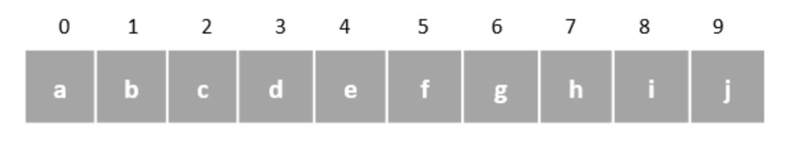
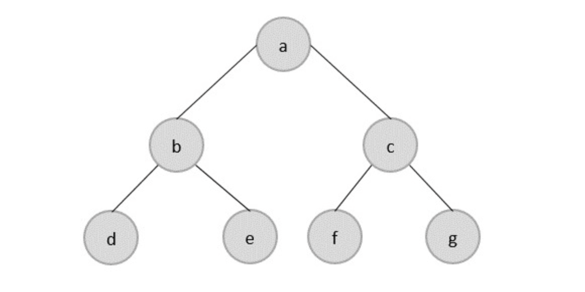
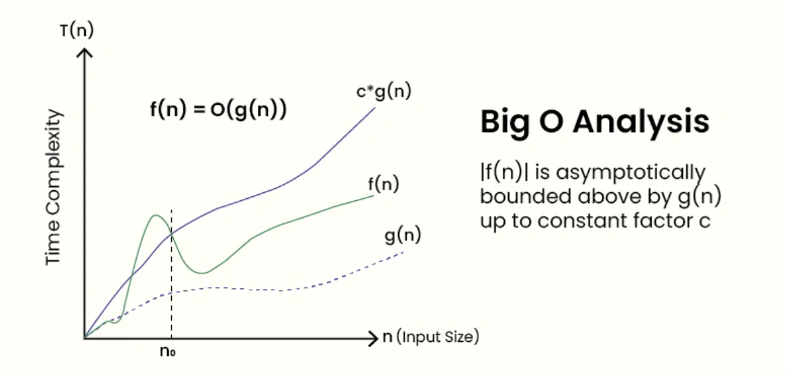
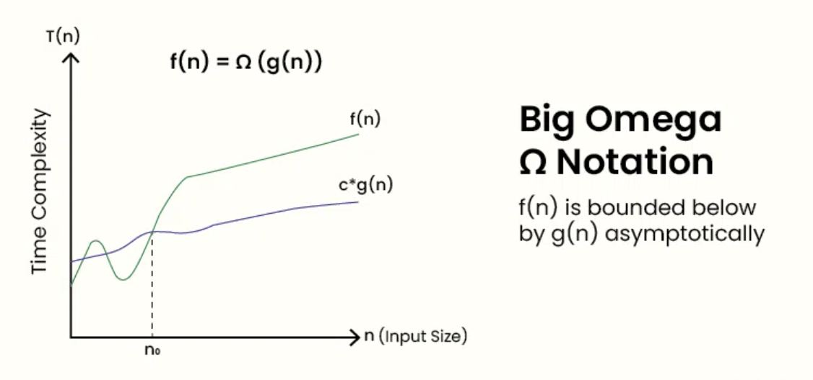
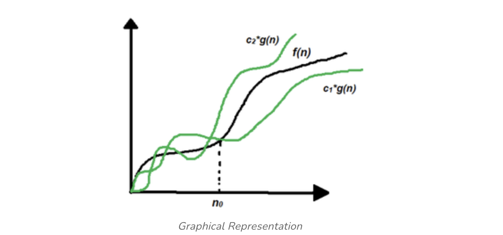

# Data Structures and Algorithms

## 1. Introduction to Data Structures

### a. Definition
A **Data Structure** is a systematic way of organizing, managing, and storing data in a computer so that it can be accessed and modified efficiently. It is not just about storing data but also about the relationship between data elements and the operations allowed on them.

### Types of Data Structures
**Linear Data Structures**:  
The data is stored in linear data structures sequentially. These are rudimentary structures since the elements are stored one after the other without applying any mathematical operations. Few examples of linear data structures include- Arrays, Linkded Lists, Stacks, Queues.

**Non-Linear Data Structures**
Non-Linear data structures store the data in the form of a hierarchy. Therefore, in contrast to the linear data structures, the data can be found in multiple levels and are difficult to traverse through. Few examples of non-linear data structures are - Graphs, Trees, Maps.

### b. Abstract Data Type (ADT)
An **Abstract Data Type (ADT)** is a high-level description of a data structure that specifies **what** operations can be performed on the data, but not **how** these operations will be implemented.

* **Logic vs. Implementation:** It separates the logical properties from the physical storage.
* **Components:**
    * **Data:** The values being stored.
    * **Operations:** Methods like `insert()`, `delete()`, `search()`, `sort()`.
* **Examples:** A **Stack** ADT defines operations like `push()` and `pop()`, whether it's built using an array or a linked list is an implementation detail.

### c. Importance of Data Structures
As applications become complex and data-rich, three main problems arise that data structures help solve:

1.  **Processor Speed:** High-speed data processing requires organized data for quick retrieval.
2.  **Data Search:** Searching through millions of items (e.g., a Google search or inventory) is only feasible with optimized structures like Trees or Hash Tables.
3.  **Multiple Requests:** If thousands of users search data simultaneously, efficient structures minimize the load on the server.

---

## 2. Asymptotic Notations

Asymptotic notation is the mathematical language used to describe the **efficiency** of an algorithm as the input size ($n$) grows toward infinity. It focuses on the "growth rate" rather than specific execution times in milliseconds.

## 3. Complexity Analysis
Complexity analysis is the process of determining the amount of resources (time and storage) required to run an algorithm. This is essential for comparing two different algorithms designed to solve the same problem.

### a. Time Complexity
Time complexity is **not** the actual time (in seconds) an algorithm takes to run, as that depends on hardware, operating system, and processor speed. Instead, it is a measure of the **number of operations** performed by an algorithm as a function of the input size ($n$).

* **Why it matters:** An algorithm that works for 10 items might fail or take years to complete when scaled to 1 million items.
* **Common Example (Linear Search):** To find an item in an array of size $n$, you might have to check every single element. Thus, the time complexity is $O(n)$.

### b. Space Complexity
Space complexity is the total amount of **memory space** used by an algorithm in relation to the input size.

> **Formula:** $\text{Total Space} = \text{Auxiliary Space} + \text{Input Space}$
> *Note: **Auxiliary Space** is the extra space or temporary space used by an algorithm.*
---

### d. Comparison Table

| Feature | Time Complexity | Space Complexity |
| :--- | :--- | :--- |
| **Focus** | Speed and efficiency of execution. | Memory usage and storage efficiency. |
| **Measured by** | Number of basic operations/steps. | Amount of memory (bytes/bits) allocated. |
| **Influenced by** | Loops, recursions, and logic. | Data structures, recursion depth, and variables. |
| **Primary Goal** | Minimize execution time. | Minimize memory footprint. |

### The Three Primary Notations

| Notation | Name | Description | Informal Meaning |
| :--- | :--- | :--- | :--- |
| **$O$** | **Big O** | Upper Bound | "It won't take longer than this" (Worst Case). |
| **$\Omega$** | **Big Omega** | Lower Bound | "It will take at least this long" (Best Case). |
| **$\Theta$** | **Big Theta** | Tight Bound | "It will take exactly this much" (Average Case). |

**Big O ($O$):**  
It is the way to express asymptotic upper bound. It f and g are any two functions from set of integers then function f(n) is said to be big oh of f(n) ie

  $f(n) = O(g(n))$ if there exist positive constants $c$ and $n_0$ such that:
    $$f(n) \le c \cdot g(n) \text{ for all } n \ge n_0$$

### Example 1
For the function:  
$f(n) = 3n^2 + 2n + 1000\log n + 5000$

1. **Ignore lower order terms:** We keep only the fastest-growing term, which is $3n^2$.
2. **Ignore constants:** Removing the coefficient $3$, we are left with $n^2$.
3. **Result:** The Big O value is **$O(n^2)$**.

---

### Example 2
For the function:  
$f(n) = 3n^3 + 2n^2 + 5n + 1$

* **Dominant Term:** $3n^3$
* **Order of Growth:** Cubic ($n^3$)
* **Big O Notation:** **$O(n^3)$**   

**Big Omega ($\Omega$):** 
It is the way to express the asymptotic lower bound of an alogrithm's time complexity. It is the **best-case** situation of algorithm. If f and g are any two functions from set of integers , then function f(n) is said to be big omega of g(n) if and only if there exists two positive constants c and n0 such that
    $$f(n) \ge c \cdot g(n) \text{ for all } n \ge n_0$$

**Big Theta ($\Theta$):** 
Big thita gives asymptotically tight bound. Let f and g be the function from the set of natural numbers. The function f is said to be ($\Theta$)g, if there are constants c1.c2 > 0 and a natural number n0 such that:
    $$c_1 \cdot g(n) \le f(n) \le c_2 \cdot g(n) \text{ for all } n \ge n_0$$

---

## 3. Summary of Common Complexities
Organized from most efficient to least efficient:

* **Constant:** $O(1)$
* **Logarithmic:** $O(\log n)$
* **Linear:** $O(n)$
* **Linearithmic:** $O(n \log n)$
* **Quadratic:** $O(n^2)$
* **Exponential:** $O(2^n)$