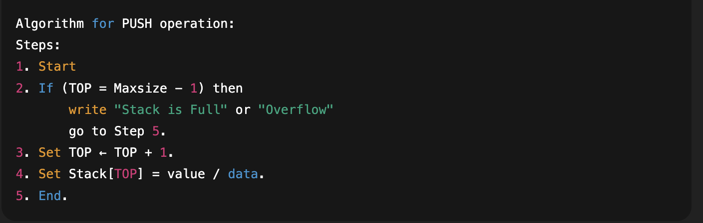
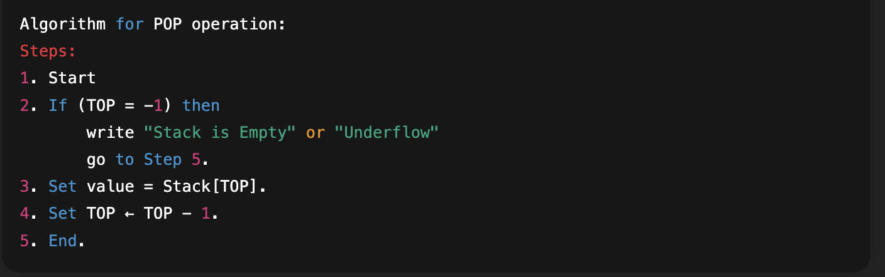
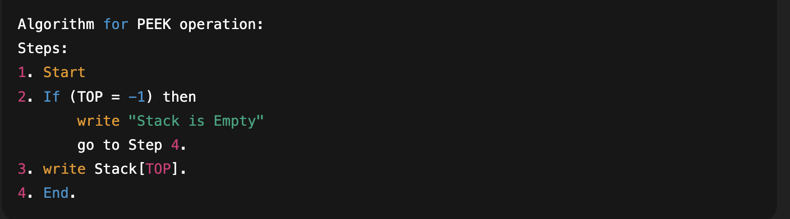
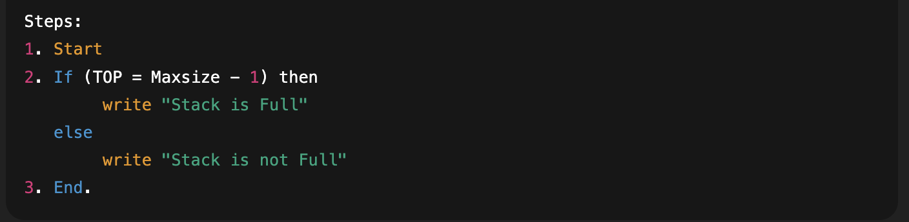
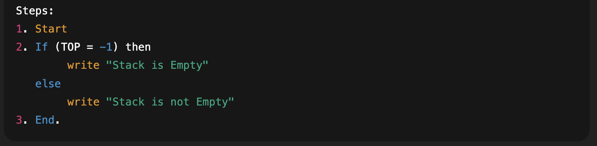
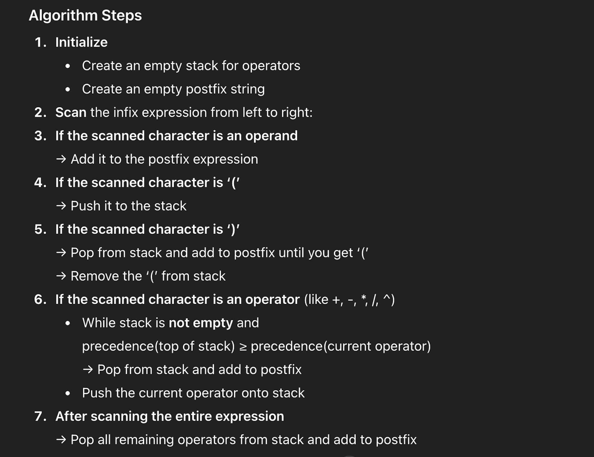
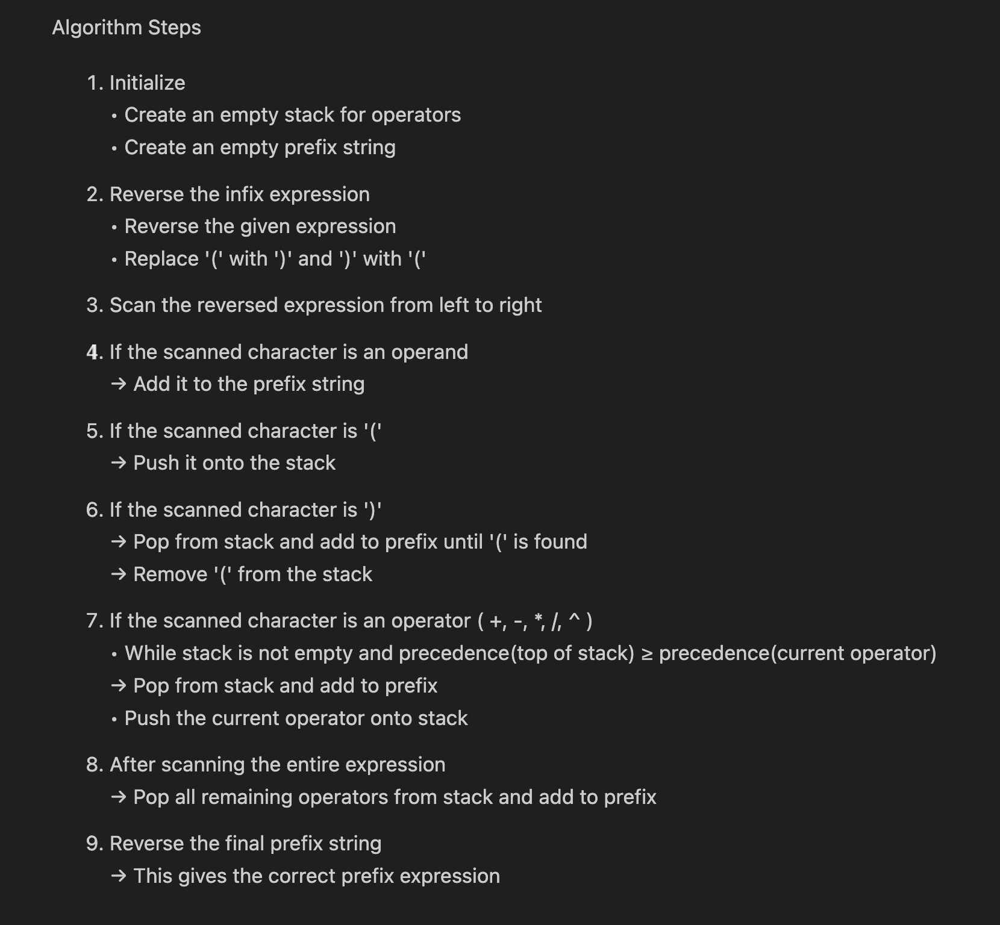
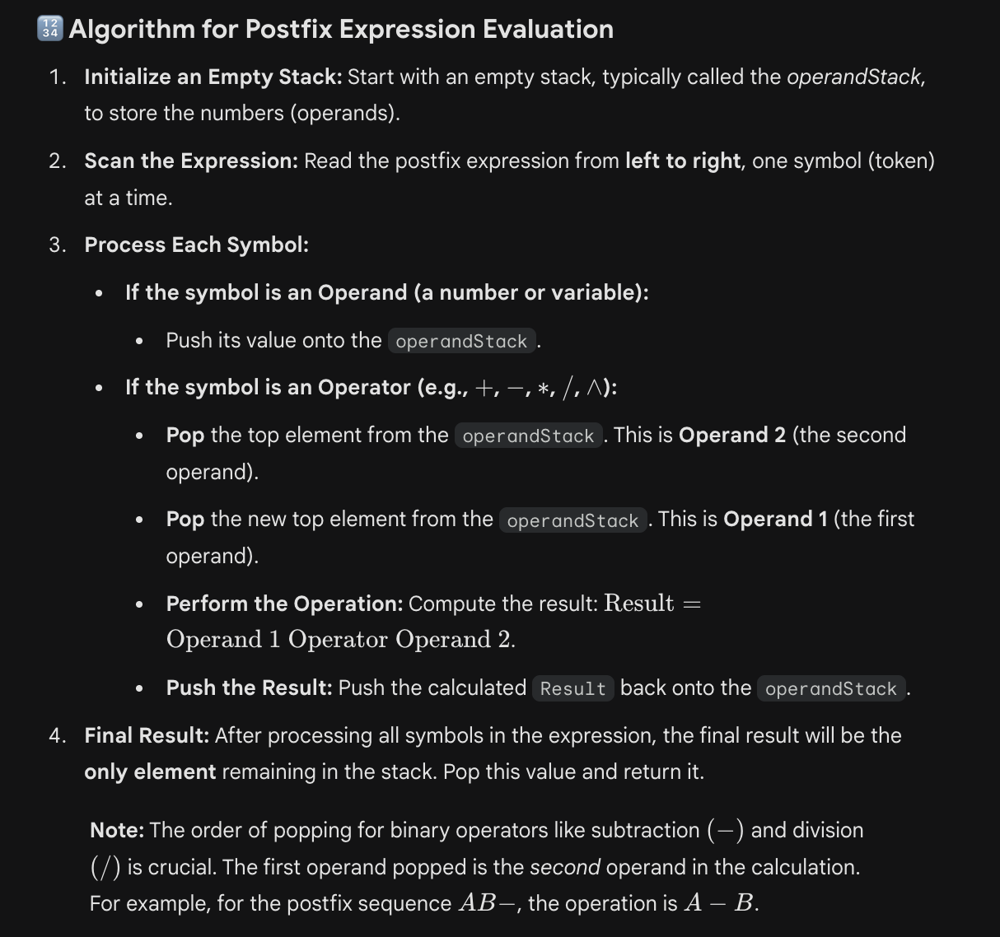
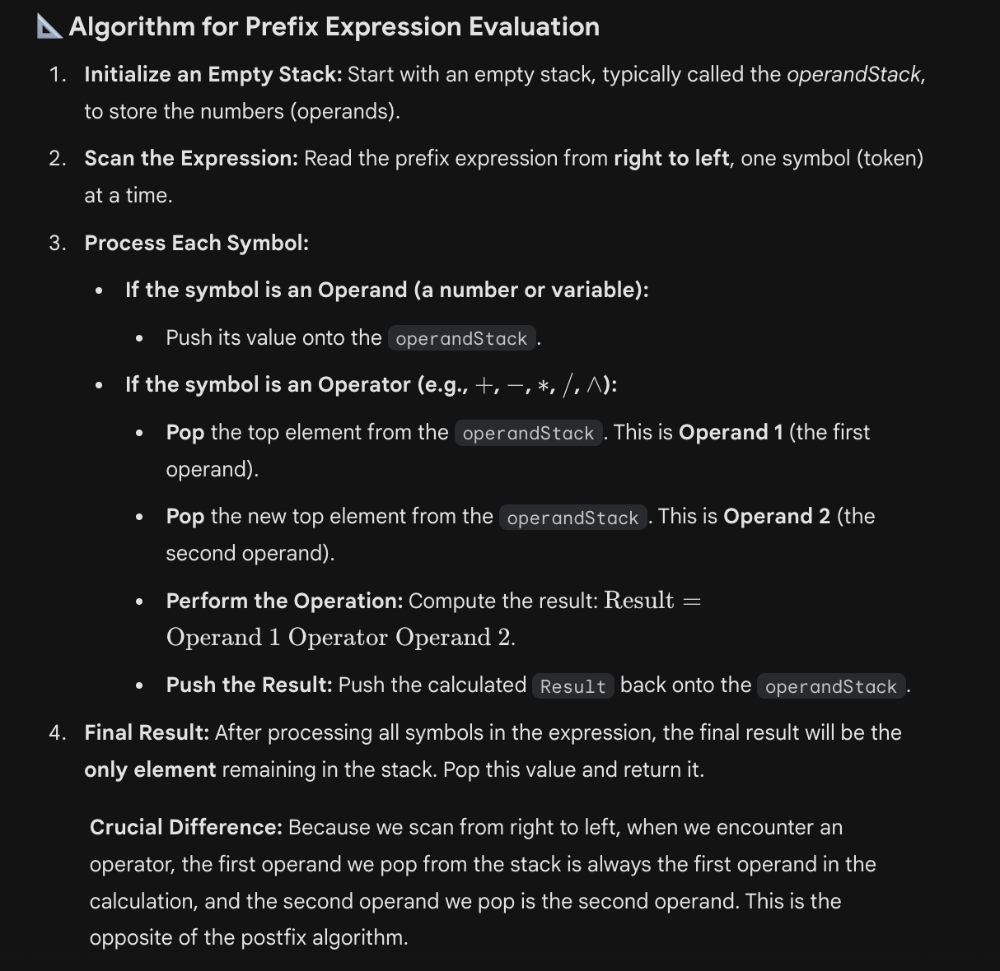

## The Stacks and Its Applications
### Introduction to Stack
A Stack is a linear data structure that follows the `Last-In First-Out (LIFO)` principle. This means the last element added to the stack is the first one to be removed. Think of it like a stack of plates; you add a new plate to the top and take the top one off first.


---
### Stack as An Abstract Data Type (ADT)
As an ADT, a stack is defined by the operations performed on it rather than its implementation. The standard operations include:
- `push(element)`: Adds an item to the top
- `pop()`: Removes and returns the top item
- `peek()`: Returns the top item without removing it.
- `isEmpty()`: Checks if the stack is empty
- `isFull()`: Checks if the stack has reached its capacity (for static arrays).

---

### Implementation of Stack
Stacks can be implemented in two primary ways:
- **Static Implementation**: Using Arrays (Fixed size).
- **Dynamic Implementation**: Using Linked Lists (Dynamic size).

### Array (Static) Implementation
In an array-based stack, we maintain a variable `top` which keeps track of the index of the last added element. Initially, `top = -1.`

``` java
public class ArrayStack {
    private int maxSize;
    private int[] stackArray;
    private int top;

    public ArrayStack(int size) {
        this.maxSize = size;
        this.stackArray = new int[maxSize];
        this.top = -1;
    }
}
```

---
### Core Operations & Algorithms
a. **PUSH Operation**


b. **POP Operation**


c. **PEEK Operation**


d. **FULL Operation**


e. **Is Empty Operation**


--- 
### Analysis of Stack Operations
All basic stack operations are highly efficient:
- **Time Complexity**: O(1) for push, pop, and peek because we only access the `top` element.

- **Space Complexity**: O(n) where n is the number of elements stored. 

---

### Arithmatic Notations
In mathematics, there are three ways to write expressions:

| Notation | Description | Example |
| :--- | :--- | :--- |
| **Infix** | Operator is between operands | A + B |
| **Prefix** | Operator is before operands | + A B |
| **Postfix** | Operator is after operands | A B + |

### Infix to Postfix Algorithm (using Stack)


--- 

### Infix to Prefix Algorithm (using Stack)


---`

### Algorithm for Postfix Expression Evaluation



### Algorithm for Prefix Expression Evaluation


### Practical Applications
- **Expression Evaluation**: Using Postfix/Prefix to calculate results.
- **Function Calls**: The JVM uses `Call Stack` to manage method execution and recursion
- **Undo/Redo**: Features in text editors
- **Backtracking**: Used in path-finding algorithms and solving puzzles like Mazes or Sudoku. 


