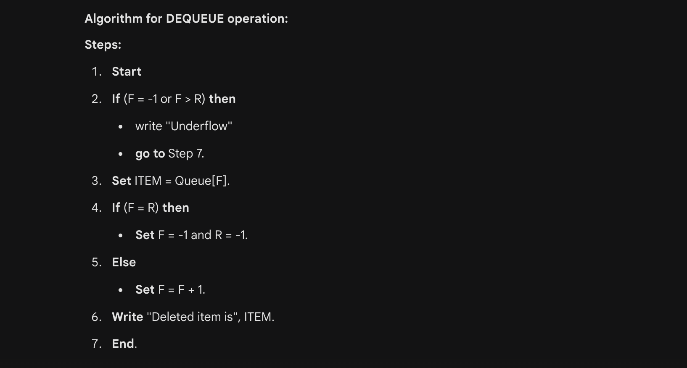

# Queue Data Structure 

## What is a Queue?

### Defination
A **Queue** is a linear data structure that follows the `First-In First-Out (FIFO)` principle. This means the first element added to the queue will be the first one to be removed. Think of it like a line of people waiting for a bus; the person at the front of the line is served first.


---

### Features of Queue
- **Two Ends**: It has two pointers: **Front** (where deletion happens) and **Rear** (where insertion happens).
- **Ordered**: It maintains the sequence of elements. 
- **Non-primitive**: It is a dynamic data structure (when implemented with linked lists) or fixed (when using arrays).

---

### Applications of Queue
- **CPU Scheduling**: Managing tasks in an Operating system (e.g. Round Robin).
- **Data Buffers**: Used in IO Buffering, disk scheduling, and printer spooling. 
- **Breadth First Search (BFS)**: Used in graphs algorithms to find the shortest path. 
- **Message Queues**: Handling asynchronous data transfer (e.g, RabbitMQ or Kafka).

---

### Queue as an ADT
The Queue Abstract Data Types defines the following operations:
- `enqueue(data)`: Adds an item to the Rear. 
- `dequeue()`: Removes and returns an item from the Front. 
- `peek()` or `front()`: Returns the front element without removing it. 
- `isEmpty()`: Return true if the queue is empty.
- `isFull()`: Returns true if the queue capacity is reached. 

---
### Operations and Algorithms
a. **Algorithm for Enqueue Operation**:


b. **Algorithn for Dequeue Operation**:



### Implementation of Queue
Queues can be implemented using:
- **Arrays**: Simple but suffers from "memory wastage" in linear queues after deletions. 
- **Linked Lists**: Dynamic and grows as needed. 

--- 
### Linear Queue
In a **linear queue**, insertion happens at one end and deletion at the other. However, it has a drawback: once the `rear` reaches the end of the array, we cannot insert more elements even if there is empty space at the beginning (caused by `dequeue` operations).


### Circular Queue
A **Circular Queue** solves the memory wastage problem of linear queues. The last position is connected back to the first position, forming a circle.
- **Key Logic**: The increment of pointers used the modulo operator: <br>
`Rear = (Rear +  1) % Size`
`Front = (Front + 1) % Size`

--- 

### Declarations and Initialization of Cicular Queue
To initialize a circular queue, both `front` and `rear` are typically set to `-1`.

``` java
class CircularQueue {
    int size;
    int[] queue;
    int front, rear;

    // Initialization
    public CircularQueue(int n) {
        this.size = n;
        this.queue = new int[n];
        this.front = -1;
        this.rear = -1;
    }
}
```

### Priority Queue
A `Priority Queue` is a special type of queue where each element is associated with a priority. Elements are served based on their priority, not just their arrival order.

#### Types of Priority Queues:
- **Ascending Priority Queue**: The element with the smallest value has the highest priority (e.g. `"Min-Priority Queue"`).
- **Descending Priority Queue**: The element with the largest value has the highest priority (e.g. `"Max-Priority Queue"`)

--- 
The operations are similar to a standard queue, but with a twist:
- `insert(item, priority)`: Adds an item with a priority.

- `getHighestPriority()`: Returns the item with the highest priority without removing it.

- `deleteHighestPriority()`: Removes the item with the highest priority.

### Comparison of Operators (O notation)
| Queue Type | Enqueue | Dequeue |
| :--- | :--- | :--- |
| **Linear Queue** | $O(1)$ | $O(1)$ |
| **Circular Queue** | $O(1)$ | $O(1)$ |
| **Priority Queue** | $O(\log n)$ (using Heap) | $O(\log n)$ |