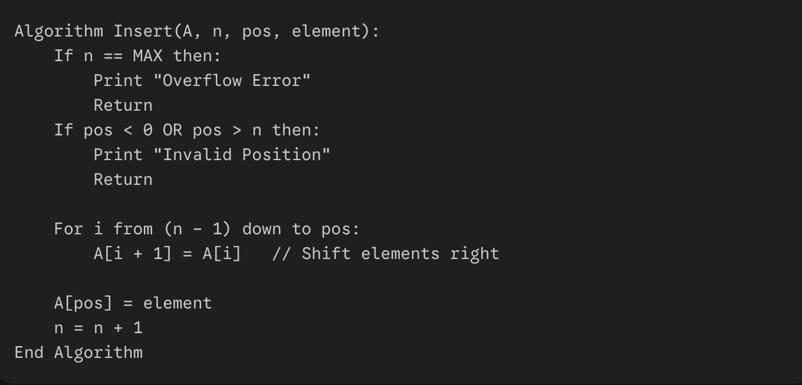
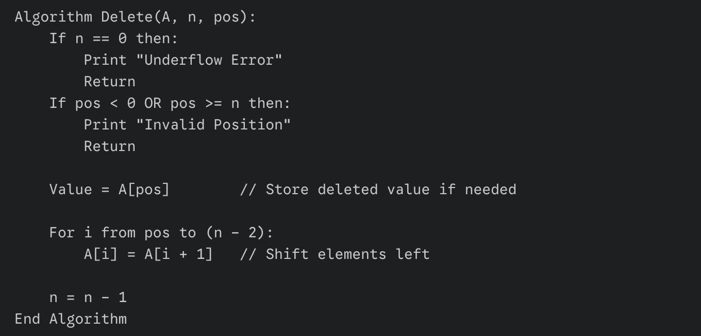
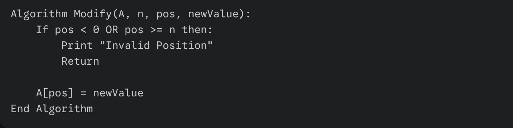
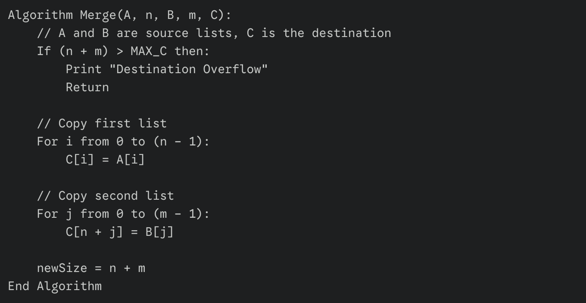
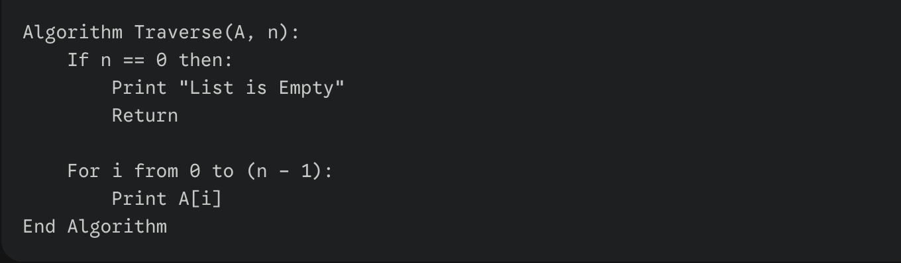

# List Data Structure 

## What is a List

### Introduction
A **List** is a linear data structure representing a collection of elements where each element has a specific position. Unlike simpler structures, a list is flexible and allows for various operations such as `insertion`, `deletion`, and `searching` at any position (`beginning`, `middle`, or `end`). Lists serve as the foundational concept for more specialized structures like `Stacks` and `Queues`.

### Characteristics
- Elements are stored in an ordered manner
- Each element has a `position (index)`
- Elements can be  `inserted` or `deleted`
- Can be implemented using `arrays` or `linked lists`

### Types of List
- Static List
- Dynamic List

### Basic Operations on List
- `Insertion`
- `Deletion`
- `Traversal`
- `Searching`
- `Updating`

### Algorithms and Operations on List
**Insert Algorithm**

**Delete Algorithm**

**Update/Modify Algorithm**

**Merge Algorithm**

**Traverse Algorithm**

---
### Static and Dynamic List Strucutre
List can be categorized based on how memory is allocated for them:
| Feature | Static List | Dynamic List |
| :--- | :--- | :--- |
| **Memory Allocation** | Allocated at compile-time. | Allocated at run-time. |
| **Size** | Fixed size; cannot be changed during execution. | Resizable; can grow or shrink as needed. |
| **Data Structure** | Typically implemented using Arrays. | Typically implemented using Linked Lists. |
| **Efficiency** | Memory might be wasted if the list is not full. | Memory is used efficiently based on the number of elements. |
| **Java Syntax** | int[]arr = int arr[5] | `List<Ingeger> list = new LinkedList<>();`
